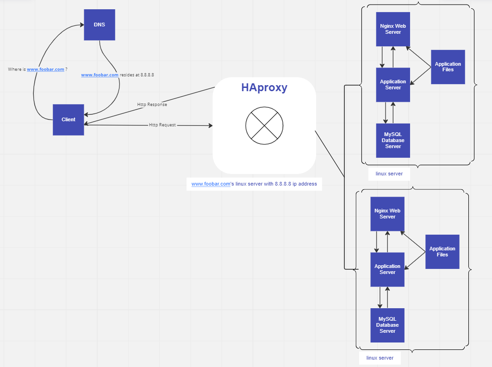

<h1>Distributed Web Infrastructures Design</h1>

<a herf="https://miro.com/app/board/uXjVPj4aDkQ=/"> Visit Online Board</a>
<h1>
    Description
</h1>

This is a distributed web infrastructure that atttempts to reduce the traffic to the primary server by distributing some of the load to a replica server with the aid of a server responsible for balancing the load between the two servers (primary and replica).

<h1>
 Specifics About This Infrastructure Design
 </h1>
<ul>
<li>
The distribution algorithm the load balancer is configured with and how it works.
The HAProxy load balancer is configured with the Round Robin distribution algorithm. This algorithm works by using each server behind the load balancer in turns, according to their weights. It’s also probably the smoothest and most fair algorithm as the servers’ processing time stays equally distributed. As a dynamic algorithm, Round Robin allows server weights to be adjusted on the go.
</li>
<li>
The setup enabled by the load-balancer.
The HAProxy load-balancer is enabling an Active-Passive setup rather than an Active-Active setup. In an Active-Active setup, the load balancer distributes workloads across all nodes in order to prevent any single node from getting overloaded. Because there are more nodes available to serve, there will also be a marked improvement in throughput and response times. On the other hand, in an Active-Passive setup, not all nodes are going to be active (capable of receiving workloads at all times). In the case of two nodes, for example, if the first node is already active, the second node must be passive or on standby. The second or the next passive node can become an active node if the preceding node is inactive.
</li>
<li>
How a database Primary-Replica (Master-Slave) cluster works.
A Primary-Replica setup configures one server to act as the Primary server and the other server to act as a Replica of the Primary server. However, the Primary server is capable of performing read/write requests whilst the Replica server is only capable of performing read requests. Data is synchronized between the Primary and Replica servers whenever the Primary server executes a write operation.
</li>
<li>
The difference between the Primary node and the Replica node in regard to the application.
The Primary node is responsible for all the write operations the site needs whilst the Replica node is capable of processing read operations, which decreases the read traffic to the Primary node.
</li>
</ul>
<h1>
    Issues With This Infrastructure
</h1>
<ul>
<li>
There are multiple SPOF (Single Point Of Failure).
For example, if the Primary MySQL database server is down, the entire site would be unable to make changes to the site (including adding or removing users). The server containing the load balancer and the application server connecting to the primary database server are also SPOFs.
</li>
<li>
Security issues.
The data transmitted over the network isn't encrypted using an SSL certificate so hackers can spy on the network. There is no way of blocking unauthorized IPs since there's no firewall installed on any server.
</li>
<li>
No monitoring.
We have no way of knowing the status of each server since they're not being monitored.
</li>
